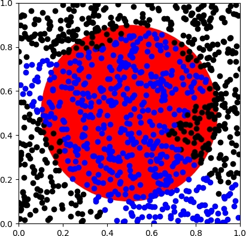
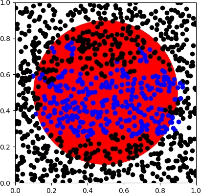
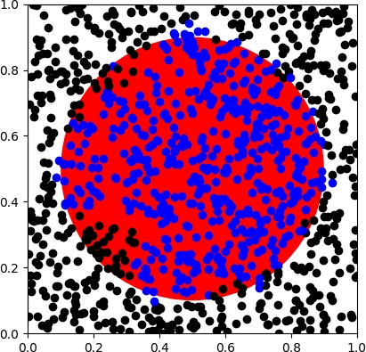
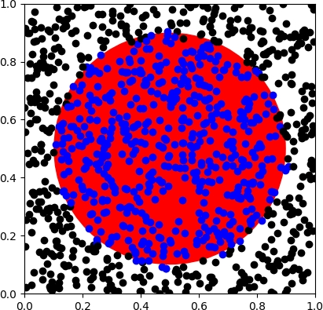

## Fuzzy ARTMAP - Description
An implementation of a Fuzzy ARTMAP in python. 
This objective of this implementation is to obtain a model capable of predicting if a given point, (x,y), is inside or outside of a given circle.
The model will be trained with a different set of point before it can perform its predictions. 

## Example

The following images shows the results of infering 1000 randomly generated point with a model trained.
A black dot indicates the models predicted that point to be outside of the circle while blue indicates a prediction within the circle.

| 10 training points  | 100 training points | 500 training points | 1000 training points|
| ------------- | ------------- | ------------- | ------------- |
|   |  |  |  |


## Usage
To train a model and obtain its predictions simply  run the `main.py` file.
You can set the optional flags `--entrenamiento` and `--inferencia` to indicate the number of points to be used for the training and inference respectively.

```
python main.py --entrenamiento <int> --inferencia <int>
```
